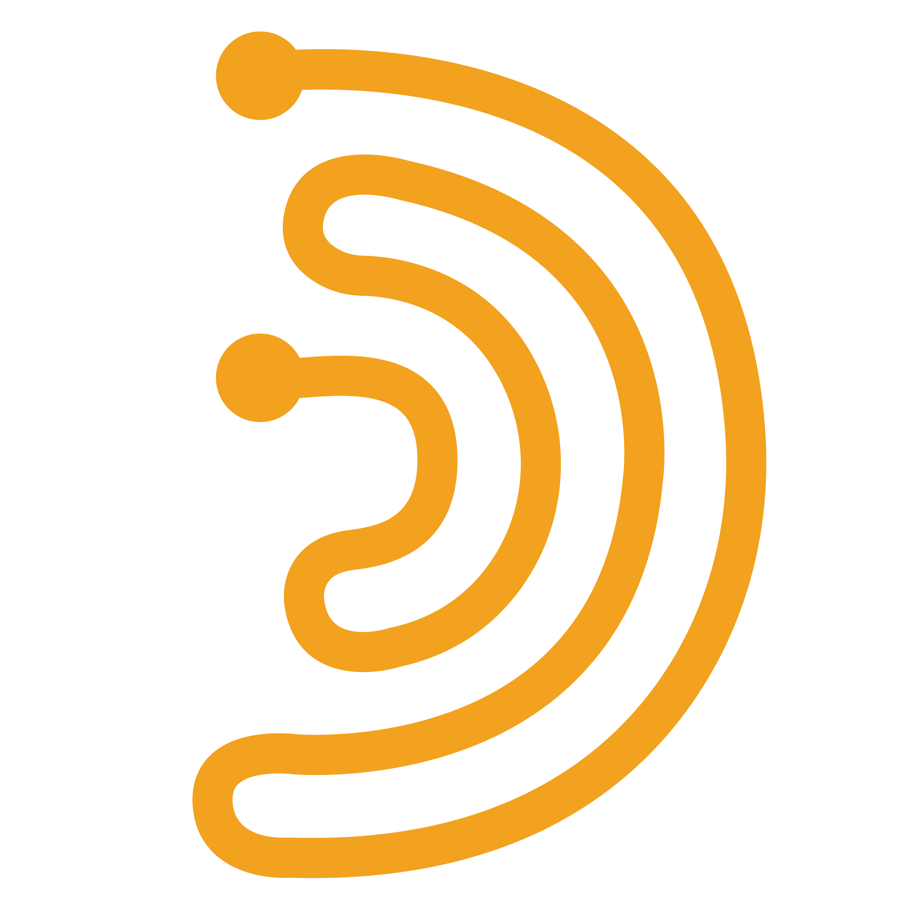
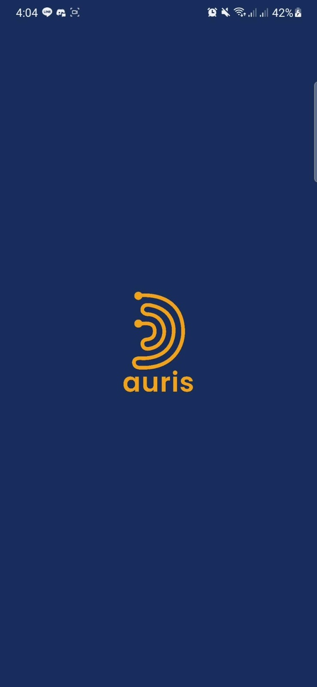
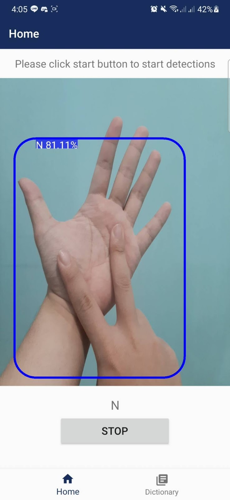
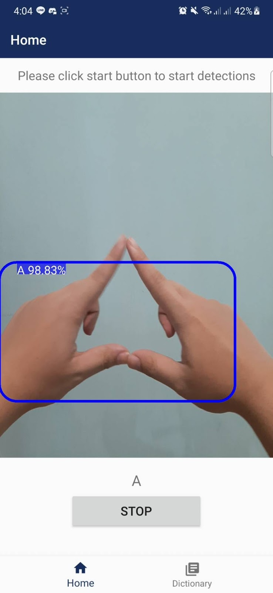

<!-- 
This readMe inspired and modified from
https://github.com/othneildrew/Best-README-Template/
 -->


<!-- PROJECT LOGO -->
<br />
<p align="center">
  <a href="https://github.com/frostygum/Auris-Bangkit-Capstone">
    
  </a>

  <h3 align="center">Auris Project</h3>
  
  <p>
  This is machine learning part of The auris project, you can explore and find out what you want according to <bold>Table of Contents</bold> bellow. If you need to find android implementation, please visit <a href="https://github.com/Evandio-Martin/AURIS-Android">this link</a>.
  </p>
</p>


<!-- TABLE OF CONTENTS -->
<details open="open">
  <summary><h2 style="display: inline-block">Table of Contents</h2></summary>
  <ol>
    <li>
      <a href="#about-the-project">About The Project</a>
      <ul>
        <li><a href="#built-with">Built With</a></li>
      </ul>
    </li>
    <li>
      <a href="#getting-started">Getting Started</a>
      <ul>
        <li><a href="#prerequisites">Prerequisites</a></li>
        <li><a href="#installation">Installation</a></li>
      </ul>
    </li>
    <li><a href="#usage">Usage</a></li>
    <li><a href="#resources">Resources</a></li>
    <li><a href="#license">License</a></li>
    <li><a href="#references">References</a></li>
  </ol>
</details>


<!-- ABOUT THE PROJECT -->
## About The Project

<div>
  <p align="center">
    
    
    
    
  </p>
</div>

AURIS helps the mutes and deafs to communicate well with other people. AURIS is an artificial intelligence to detect BISINDO sign language runs on Android. WHO estimates in South-East Asia 401 million people have some degree of hearing loss (hear-it.org) and Indonesia is the fourth country with the highest deaf-mute rate in Southeast Asia (IDN Times).

### Built With
This project build with this following frameworks and APIs
* [Tensorflow](https://www.tensorflow.org/)
* [Keras](https://keras.io/about/)
* [Tensorflow Object Detection API](https://github.com/tensorflow/models)

<!-- GETTING STARTED -->
## Getting Started

To get a local copy up and running follow these simple steps.

### Prerequisites

This is an following steps to prepare your local computer.
* Get Chocolatey (optional)
  ```powershell
    Set-ExecutionPolicy Bypass -Scope Process -Force; [System.Net.ServicePointManager]::SecurityProtocol = [System.Net.ServicePointManager]::SecurityProtocol -bor 3072; iex ((New-Object System.Net.WebClient).DownloadString('https://chocolatey.org/install.ps1'))
  ```
* Get Python 3
  ```powershell
    choco install -y python3
  ```
* Setup virtual Env
  ```python
    python -m venv labEnv
  ```
* Activate virtual env
   ```powershell
   & ./.env/Scripts/Activate.ps1
   ```
* Install require python packages
   ```powershell
   pip install -r requirements.txt
   ```

### Installation

1. Clone the repo
   ```sh
   git clone https://github.com/frostygum/Auris-Bangkit-Capstone
   ```


<!-- USAGE -->
## Usage

Before using the model training notebook, you can use dataPrep.ipynb notebook to reduce the image size to you apropiate size use case and split train test your data.
Then all the steps are already mention in following notebook. Here are final notebook to be used:
* handSignGestureMobileNet.ipynb 
* handSignGestureMobileNetTFRecord.ipynb
* handSignGestureSSDMobileNet.ipynb


<!-- RESOURCES -->
## Resources
Here are recources according to our implementation
* [Notebooks](https://drive.google.com/drive/folders/18_GtZdz7H__eD_HL-DldvTHFquzrxOZ7)
* [Datasets](https://drive.google.com/drive/u/2/folders/1mxGvB2SiYFainMwOEhbyTU0DKYDagxdT)
* [Models](https://drive.google.com/drive/folders/1-ARQZvWNCsgWLT-dfBflF4Y13kzB5rCT)
* [Deployed Android](https://drive.google.com/drive/folders/1t2ZbTjktglCBmBJUF1N0w8u1DD4YnXFh)
* [Android Repository](https://github.com/Evandio-Martin/AURIS-Android)


<!-- LICENSE -->
## License

Distributed under the MIT License. See `LICENSE` for more information.


<!-- REFRENCES -->
## References

* [MobileNetV2: Inverted Residuals and Linear Bottlenecks](https://arxiv.org/pdf/1801.04381.pdf)
* [MobileNets: Efficient Convolutional Neural Networks for Mobile VisionApplications](https://arxiv.org/pdf/1704.04861.pdf)
* [Mobile Sign Language Recognition for Bahasa Indonesia using Convolutional Neural Network](https://dl.acm.org/doi/abs/10.1145/3282353.3282356)
* [Machine learning model for sign language interpretation using webcam images](https://ieeexplore.ieee.org/document/6839279)
* [RESPON TUNARUNGU TERHADAP PENGGUNAAN SISTEM BAHASA ISYARAT INDONESA (SIBI) DAN BAHASA ISYARAT INDONESIA (BISINDO) DALAM KOMUNIKASI](http://ejournal.uin-suka.ac.id/pusat/inklusi/article/view/1109)
